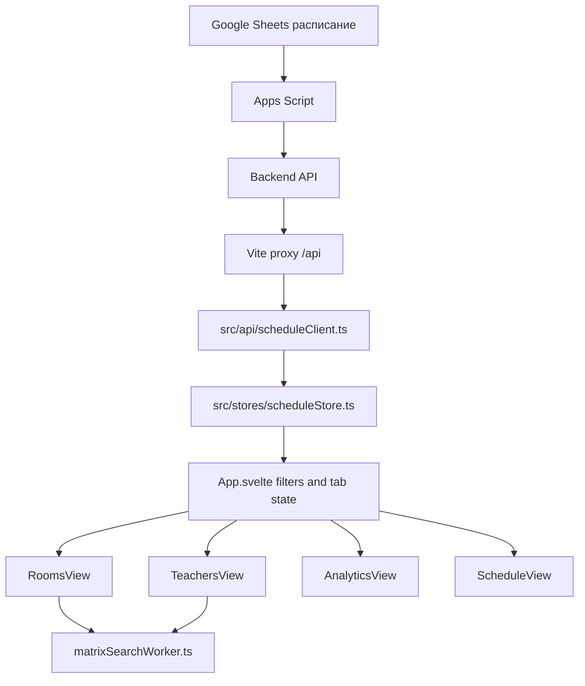

# RFICT Schedule: project documentation

Дата актуализации: 2026-06-06.

Этот документ описывает текущий web-проект `rfict-schedule`: назначение, стек, поток данных, архитектуру UI, файлы, интеграции и известные технические долги. Он заменяет старые разрозненные Markdown-файлы.

## 1. Назначение проекта

`rfict-schedule` - одностраничное приложение для просмотра и анализа расписания РФиКТ.

Основные сценарии:

- просмотр расписания по неделям, группам, типам занятий и поиску;
- матрица занятости аудиторий;
- матрица занятости преподавателей;
- план-факт по предметам, группам, типам занятий и проведенным парам;
- переход из ячейки занятия в связанную Google Sheets таблицу;
- работа с данными, которые приходят из backend API и частично поддерживаются Apps Script интеграцией в Google Sheets.

## 2. Стек

- Svelte 5 с runes API: `$state`, `$derived`, `$effect`, `$props`.
- Vite 6 для dev server и production build.
- TypeScript.
- Tailwind CSS плюс большой проектный `src/index.css`.
- `@lucide/svelte` для иконок.
- `date-fns` есть в зависимостях, но в текущей карте основных файлов не является центральной частью UI.
- Backend API проксируется через Vite на `https://rfict.up.railway.app`.
- Apps Script используется для Google Sheets sidebar, генерации недельных листов, парсинга и отправки расписания.

## 3. Команды

```bash
npm run dev
npm run check
npm run build
npm run lint
npm run preview
```

Что делают команды:

- `dev`: запускает Vite dev server.
- `check`: запускает `svelte-check` по `tsconfig.app.json`.
- `build`: запускает `check`, затем `tsc -b`, затем `vite build`.
- `lint`: запускает ESLint по проекту.
- `preview`: запускает Vite preview.

## 4. Переменные окружения

Файл `.env.example`:

```env
VITE_API_BASE_URL=
```

Пустое значение означает same-origin `/api`. В dev/preview это работает через proxy в `vite.config.ts`. Абсолютный URL стоит использовать только если backend разрешает CORS для браузера.

## 5. Высокоуровневый поток данных



Главная идея текущей архитектуры:

1. `scheduleClient.ts` нормализует backend ответы.
2. `scheduleStore.ts` кеширует данные, строит индексы, держит планы и SSE refresh.
3. `App.svelte` хранит выбранный tab и фильтры.
4. Views получают уже подготовленные данные и выполняют локальную фильтрацию/рендер.
5. Матрицы аудиторий и преподавателей используют Web Worker для поиска и фильтрации.

## 6. Runtime-состояние

### 6.1 App state

Файл: `src/App.svelte`.

Хранит:

- `activeTab`: текущая вкладка в header.
- `renderedTab`: вкладка, которая фактически смонтирована.
- `switchingTab`: вспомогательное состояние для анимации ухода.
- `filters`: выбранный курс, неделя, группа, подгруппа, типы занятий, search.
- `debouncedSearch`: search после debounce.
- `searchSuggestion`: ghost-completion в поиске.
- `autoWeekCourse`: защита автоподбора текущей недели от повторного срабатывания.

Важные вычисления:

- `selectedWeeks`: недели по номеру из store index.
- `selectedWeekLessons`: уроки выбранной недели.
- `searchCandidates`: кандидаты для автодополнения поиска.
- `filteredWeekLessons`: уроки для вкладки "Расписание".

### 6.2 Schedule store

Файл: `src/stores/scheduleStore.ts`.

Отвечает за:

- загрузку данных курса или всех курсов;
- чтение и запись кеша в `localStorage`;
- in-memory кеш;
- debounce записи кеша;
- SSE subscription на `/api/v1/sse/schedule`;
- optimistic update план-факта;
- построение индексов:
  - `weeksByNumber`;
  - `lessonsByWeek`;
  - `lessonsByRoom`;
  - `lessonsByTeacher`;
  - `roomOccupancyByWeek`;
  - `teacherOccupancyByWeek`;
  - `groupNameById`.

Ключевой технический момент: `roomOccupancyByWeek` и `teacherOccupancyByWeek` уже считаются заранее в store, поэтому views не должны заново строить матрицы из сырых lessons.

### 6.3 UI preference stores

Файлы:

- `src/stores/themeStore.ts`;
- `src/stores/columnOrder.ts`;
- `src/stores/columnGroups.ts`.

`themeStore.ts`:

- хранит `dark` или `light`;
- читает/пишет `localStorage` key `rfict-theme`;
- синхронизирует класс `.dark` на `document.documentElement`.

`columnOrder.ts`:

- хранит пользовательский порядок колонок для `rooms` и `teachers`;
- пишет в `localStorage`;
- предоставляет `applyColumnOrder`, `move`, `moveToEnd`.

`columnGroups.ts`:

- хранит пользовательские группы колонок для `rooms` и `teachers`;
- умеет добавлять, удалять, переименовывать группы;
- назначает/снимает item из группы;
- строит `ColumnSection[]` и `ColumnSlot[]` для рендера матрицы.

## 7. API слой

Файл: `src/api/scheduleClient.ts`.

Основные функции:

- `loadCourseSchedule(course)`: получает расписание курса и нормализует разные формы backend ответа.
- `loadCoursePlan(course)`: получает план-факт по курсу.
- `loadCourseBundle(course)`: параллельно получает schedule + plan.
- `loadAllCoursesBundle()`: загружает все поддерживаемые курсы и объединяет их в `MergedSchedule`.
- `saveCoursePlanEntry(entry)`: сохраняет план-факт через `PUT /api/v1/plan`.
- `planKey(...)`: строит ключ плана.
- `planSubjectForType(...)`: сериализует subject + type для backend.

Backend endpoints, которые ожидает frontend:

- `GET /api/v1/schedule?course=N`
- `GET /api/v1/plan?course=N`
- `PUT /api/v1/plan`
- `GET /api/v1/sse/schedule`

В dev/preview `/api` проксируется на Railway backend через `vite.config.ts`.

## 8. Типы данных

Файл: `src/types/schedule.ts`.

Главные типы:

- `LessonType`: тип пары (`lecture`, `lab`, `practice`, `seminar`, `curator_hour`, `additional`, `unknown`).
- `ScheduleGroup`: группа.
- `ScheduleLesson`: занятие.
- `WeekSchedule`: расписание одной недели.
- `CourseSchedule`: расписание одного курса.
- `MergedSchedule`: объединенное расписание нескольких курсов.
- `FiltersState`: состояние фильтров UI.
- `CoursePlanEntry`: запись план-факта.
- `CoursePlanMap`: map ключа плана в число пар.
- `AnalyticsCell`: план, запланировано в расписании, проведено.
- `SubgroupParity`: четность подгруппы.

## 9. Feature views

### 9.1 RoomsView

Файл: `src/features/rooms/RoomsView.svelte`.

Назначение:

- показывает матрицу аудиторий: дни x пары x аудитории;
- применяет фильтры группы, типа занятия и поиска;
- показывает tooltip по занятым слотам;
- позволяет открыть Google Sheet по занятию;
- поддерживает drag-and-drop порядка аудиторий и групп аудиторий;
- использует `matrixSearchWorker.ts`.

Ключевые зоны:

- worker setup и fallback search;
- `filteredRoomData`, `roomMatch`;
- `columnSections`, `columnSlots`;
- `buildTooltipEntriesByKey`;
- pointer-based DnD;
- `mergeTooltipEntries`.

Текущие риски:

- много логики смешано в одном компоненте;
- часть логики почти полностью дублируется в `TeachersView`;
- поиск возвращает новый filtered occupancy, что создает лишний churn;
- подсветка search state навешивается на большое количество ячеек.

### 9.2 TeachersView

Файл: `src/features/teachers/TeachersView.svelte`.

Назначение:

- показывает матрицу преподавателей: дни x пары x преподаватели;
- фильтрует по группе, типу и поиску;
- показывает tooltip по слотам преподавателя;
- открывает Google Sheet;
- поддерживает drag-and-drop порядка преподавателей и групп преподавателей;
- использует тот же `matrixSearchWorker.ts`.

Ключевая особенность:

- поиск преподавателей сейчас работает через `searchKeyByTeacher`.
- tooltip рендерит сырые `tooltip.entries`, без такой агрегации, как в RoomsView.

Текущие риски:

- дублирование с RoomsView;
- большой DOM на вкладке;
- tooltip дублирует строки при нескольких группах;
- подсветка и dimming меняют классы большого числа ячеек.

### 9.3 AnalyticsView

Файл: `src/features/analytics/AnalyticsView.svelte`.

Назначение:

- показывает план-факт по курсам, предметам, группам, типам и подгруппам;
- считает planned, scheduled, done, remaining, percent;
- позволяет редактировать план-факт;
- сохраняет изменения через `onPlanChange`;
- экспортирует текущие видимые строки в CSV.

Состояние:

- `planInputs`: локальные значения input до сохранения;
- `savingRows`: индикаторы сохранения;
- `saveStatus`: saved/error состояния;
- `expandedSubjects`, `expandedGroups`: раскрытие иерархии;
- `today`: обновляется раз в минуту.

Текущие риски:

- `buildPlanFactHierarchy` тяжелый и вызывается как `$derived`;
- внутри иерархии много вложенных проходов и фильтраций;
- UI содержит много row-level вычислений прямо в разметке.

### 9.4 ScheduleView

Файл: `src/features/schedule/ScheduleView.svelte`.

Назначение:

- показывает обычную таблицу занятий выбранной недели;
- группирует занятия по дням;
- показывает summary статистику;
- открывает Google Sheet по строке занятия;
- выводит предмет, преподавателя, аудиторию, группу, подгруппу, период и комментарии.

Состояние:

- `lessonPress`: отличает click от drag/move перед открытием Google Sheet.

Текущие риски:

- меньше проблем с производительностью, чем у матриц;
- часть строк в UI имеет mojibake в исходниках;
- таблица может стать тяжелой при больших данных, если показывать все курсы без пагинации.

## 10. Layout и controls

### 10.1 AppShell

Файл: `src/components/layout/AppShell.svelte`.

Назначение:

- sticky header;
- навигация по tabs;
- кнопка refresh;
- переключатель темы;
- слот controls;
- main content slot.

Состояние:

- `scrolled`: меняет shadow header при scroll;
- `themeKey`, `refreshKey`: используются для key-анимаций иконок.

### 10.2 TopFilters

Файл: `src/components/layout/TopFilters.svelte`.

Назначение:

- compact filters в header;
- выбор курса;
- выбор группы;
- выбор недели;
- выбор типа занятия;
- search input;
- search suggestion ghost text;
- reset active filters.

Текущие риски:

- search draft синхронизируется с внешним filter state через несколько эффектов;
- input публикует search наверх немедленно, App уже debounce-ит отдельно;
- dropdown options пересчитываются внутри компонента;
- reset/hidden fields монтируются и скрываются локальными CSS-анимациями.

### 10.3 GlobalFilters

Файл: `src/components/layout/GlobalFilters.svelte`.

Назначение:

- альтернативная/старая карточка фильтров.

Текущий статус:

- в `App.svelte` используется `TopFilters`, а `GlobalFilters` не подключен в основной поток;
- кандидат на удаление после проверки, если нет внешнего использования.

## 11. UI компоненты

### Button

Файл: `src/components/ui/Button.svelte`.

Базовая кнопка с вариантами:

- `primary`;
- `secondary`;
- `ghost`;
- `danger`.

Риски:

- использует `transition-all`, что удобно, но нежелательно для performance-hot зон.

### Card

Файл: `src/components/ui/Card.svelte`.

Обертка карточки с optional header и content slot.

Риски:

- hover transform/shadow и `transition-all` не стоит использовать в плотных таблицах и hot UI.

### Input

Файл: `src/components/ui/Input.svelte`.

Базовый controlled/bindable input.

### FilterSelect

Файл: `src/components/ui/FilterSelect.svelte`.

Кастомный dropdown:

- открывается локальным `open`;
- закрывается по outside pointerdown и Escape;
- рендерит menu через `{#if open}`.

Риски:

- меню монтируется/размонтируется без централизованного popover-layer;
- нет keyboard navigation кроме Escape;
- нет portal, поэтому z-index и clipping зависят от родителей.

### Highlight

Файл: `src/components/ui/Highlight.svelte`.

Подсветка текстового query в строке.

Текущий статус:

- не является центральной частью текущего App flow;
- потенциально заменить на precomputed highlight spans или удалить, если не используется.

## 12. Библиотеки проекта

### constants

Файл: `src/lib/constants.ts`.

Хранит:

- labels типов занятий;
- color tones типов;
- порядок дней;
- пары;
- список курсов;
- времена пар;
- lecture halls.

Важное замечание: часть строк в файле сейчас выглядит как mojibake. Это надо исправлять отдельной фазой.

### schedule

Файл: `src/lib/schedule.ts`.

Крупная доменная библиотека.

Функции:

- labels и форматирование занятий;
- Google Sheets URL;
- фильтрация занятий;
- группировка занятий по дням;
- статистика;
- нормализация аудиторий и преподавателей;
- поиск аудиторий/занятий преподавателей;
- subgroup parsing;
- active subgroup logic по четности недели;
- plan-fact hierarchy;
- status/progress helpers.

Текущие риски:

- файл очень большой и содержит несколько разных доменов;
- аналитика, subgroup parsing, filter helpers и UI helpers смешаны;
- `buildPlanFactHierarchy` требует отдельного индекса и кеширования.

### utils

Файл: `src/lib/utils.ts`.

Функции:

- `cn`: className combiner;
- plural/updated-at formatting;
- normalize/search normalize;
- search key construction;
- очистка search candidate;
- teacher search normalization.

Текущие риски:

- содержит mojibake в строках и regex;
- кеши нормализации глобальные, простые, с очисткой при лимите;
- search normalization нужно покрыть тестами после исправления кодировки.

### matrixSearchWorker

Файл: `src/lib/matrixSearchWorker.ts`.

Назначение:

- держит source матриц в worker;
- фильтрует rooms/teachers;
- строит matches;
- возвращает результат в main thread.

Текущая проблема:

- `postMessage({ source })` clone-ит большие объекты;
- worker возвращает новый `filtered` occupancy, что приводит к замене объектов и массовому render churn;
- похожая fallback logic продублирована в views.

### matrixDrag

Файл: `src/lib/matrixDrag.ts`.

Функции:

- `resolveMatrixDropTarget`: находит column/group под pointer через DOM;
- `autoScrollMatrixWrap`: автоскролл при drag около краев.

Риски:

- `document.elementFromPoint` на каждый drag frame может давать микродерганье;
- лучше кэшировать hitboxes на старт drag.

### googleSheets

Файл: `src/lib/googleSheets.ts`.

Функции:

- строит URL Google Sheets;
- открывает sheet в именованном окне `rfict-sheet-{id}`.

## 13. Styling

### index.css

Файл: `src/index.css`.

Содержит:

- Tailwind layers;
- CSS variables theme;
- base styles;
- header styles;
- filters;
- dense tables;
- matrix layout;
- matrix drag/drop;
- slot styles;
- tooltip;
- analytics table;
- keyframes.

Текущие риски производительности:

- много `transition-all`;
- sticky table + shadows + opacity + pseudo-elements;
- `.slot-column-match::before` создает декоративную сетку на большом числе ячеек;
- hover transform для busy cells;
- несколько `backdrop-filter`;
- `will-change` на множестве элементов.

Нужно разделить стили на:

- tokens/theme;
- layout;
- controls;
- matrix;
- analytics;
- animations.

## 14. Public data

Файлы:

- `public/index.html`;
- `public/schedule/course_1/1.json`;
- `public/schedule/course_3/1.json`;
- `public/schedule/course_3/2.json`;
- `public/schedule/course_3/3.json`;
- `public/schedule/course_3/16.json`;
- `public/schedule/course_3/25.05-30.05(16-неделя).json`.

Назначение:

- `public/index.html` выглядит как legacy/static entry.
- `public/schedule/...` - статические JSON расписаний, вероятно образцы или GitHub export target.

Текущий frontend через `scheduleClient.ts` работает с backend `/api/v1/schedule`, а не напрямую с этими JSON. Если JSON должны быть fallback-источником, это нужно явно реализовать.

## 15. Apps Script integration

Папка: `apps_script/labs_form`.

Назначение:

- Google Sheets меню;
- sidebar для добавления/редактирования занятий;
- initial setup dialog;
- semester generator;
- template application;
- parsing ячеек расписания;
- delayed export/autosave;
- push schedule update в backend/GitHub.

Файлы:

- `appsscript.json`: manifest, timezone `Europe/Minsk`, V8 runtime, scopes для текущей spreadsheet, UI, external requests, triggers.
- `Code.gs`: главный скрипт. Меню, sidebar, setup, dictionary fetch, apply lesson, copy previous week, parse cells, autosave, delayed export, trigger management, dispatch schedule update.
- `Generator.gs`: генерация семестровых листов по шаблону, расчет недель, дат и звонков.
- `Template.gs`: загрузка bundled template и применение форматирования к sheet.
- `BundledTemplate.gs`: большой JSON-like bundled template для листа расписания.
- `Sidebar.html`: UI sidebar для ввода занятия, autocomplete, validation, submit.
- `SetupDialog.html`: UI первичной настройки.
- `GeneratorDialog.html`: UI генерации семестра.

Критичные свойства Apps Script:

- backend default: `https://rfict.up.railway.app`;
- endpoint schedule: `/api/v1/schedule`;
- delayed export сейчас выставлен на 1 секунду;
- есть механика включения/выключения push;
- есть dictionary refresh после autosave;
- есть installable edit trigger.

## 16. Config files

### package.json / package-lock.json

Хранят зависимости и scripts. `package-lock.json` фиксирует версии.

### vite.config.ts

Настраивает:

- Svelte plugin;
- alias `@` -> `src`;
- proxy `/api` на Railway backend для dev и preview.

### tailwind.config.ts

Настраивает:

- dark mode by class;
- design tokens через CSS variables;
- shadows;
- radii;
- grid templates;
- animations;
- custom timing functions.

### svelte.config.js

Включает `vitePreprocess`.

### tsconfig.json / tsconfig.app.json / tsconfig.node.json

TypeScript configuration для app и node-side config файлов.

### eslint.config.js

ESLint flat config.

### postcss.config.js

Подключает Tailwind и Autoprefixer.

### vercel.json

Vercel deployment configuration.

### index.html

Vite HTML entry. Должен содержать root node для `src/main.ts`.

### .env.example

Документирует `VITE_API_BASE_URL`.

### opencode.json

Конфиг opencode. После удаления старого `AGENTS.md` должен ссылаться на актуальную документацию или не ссылаться на Markdown вообще.

### LICENSE

Лицензия проекта.

### docs/coursework_bsu.docx

Документ coursework. Не является runtime частью приложения.

## 17. Известные проблемы текущего состояния

1. Производительность поиска:
   - ввод в search запускает worker/fallback и меняет состояние большой части матрицы;
   - подсветка и dimming применяются к тысячам ячеек;
   - CSS подсветки тяжелый для scroll.

2. Дублирование матриц:
   - RoomsView и TeachersView содержат почти одинаковый код worker, tooltip, DnD, grouping, render.

3. Worker protocol:
   - передает и возвращает большие объекты;
   - лучше передавать компактные индексы и результат в виде ids/sets.

4. Анимации:
   - много локальных transitions и keyframes;
   - нет единой animation system;
   - часть анимаций находится в hot path.

5. Tooltip:
   - преподавательская матрица не агрегирует похожие entries;
   - аудитории агрегируют по subject/teacher/type/time/cancelled, но группы можно сворачивать компактнее.

6. План-факт:
   - `buildPlanFactHierarchy` требует отдельного индексированного builder;
   - сейчас логика расчетов и UI сильно связаны.

7. Кодировка:
   - в части `.ts` и `.svelte` файлов виден mojibake (`Ð...`, `Â...`);
   - перед рефактором UI-текстов нужно нормализовать кодировку и проверить, что runtime строки не испорчены.

8. Мертвые или устаревшие элементы:
   - `GlobalFilters.svelte` выглядит как неиспользуемая старая версия фильтров;
   - `Highlight.svelte` не участвует в основном UI flow;
   - статические `public/schedule` JSON не подключены как fallback.

## 18. Архитектурные рекомендации

Главное направление: оставить доменную модель расписания, но разделить вычисления, presentation и interaction.

Целевая структура:

```text
src/
  features/
    matrix/
      matrixTypes.ts
      matrixFilter.ts
      matrixWorkerClient.ts
      matrixTooltip.ts
      matrixDnd.ts
      MatrixView.svelte
      RoomMatrixAdapter.ts
      TeacherMatrixAdapter.ts
    rooms/
      RoomsView.svelte
    teachers/
      TeachersView.svelte
    analytics/
      analyticsIndex.ts
      AnalyticsView.svelte
    schedule/
      ScheduleView.svelte
  lib/
    schedule/
      normalize.ts
      subgroup.ts
      filters.ts
      planFact.ts
      stats.ts
```

Основные правила:

- store строит стабильные индексы;
- views не создают новые большие occupancy objects при каждом поиске;
- worker возвращает только compact result ids;
- search state меняет sets/flags, а не весь DOM;
- CSS hot path не использует shadows, masks, filters, huge pseudo-elements;
- DnD остается pointer-based, но hit testing кэшируется;
- analytics строится через предварительный индекс.

